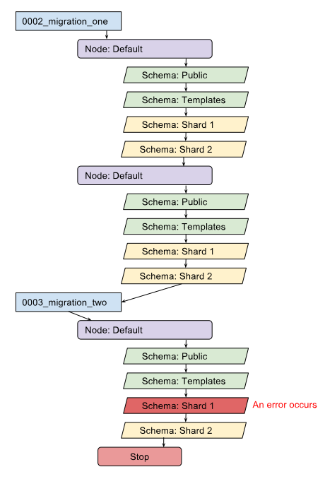

==========
Migrations
==========

Since we work with multiple nodes and multiple schemas, performing migrations is more involved.

* Mirrored models are always migrated to the public schema of each node.
* Sharded models are migrated to each (non-public) schema of all nodes.
* Default models (those who are neither Mirrored nor Sharded) only end up on the public schema of the default node.

Determining where models go is done by the DynamicDbRouter on basis of the decorators set on the model definitions.

Using the normal ``migrate`` command will migrate all models to the public schema of the default shard.
Doing so will break a number of things and is therefore discouraged.

This library provides a ``migrate_shards`` management command that executed the migration on each shard of each node.

Making migrations
-----------------
Creating migrations is done as usual. Since it is executed for each shard on each node, you do not have to use ``use_shard`` in data migrations.

Calling migrate_shards
----------------------

``migrate_shards`` Does two things regarding the way it applies migrations:

Determine migration state
~~~~~~~~~~~~~~~~~~~~~~~~~

Like the original, the command has to determine what the current state of the database is, to draft a list of migrations to execute: the migration plan.
Since we have multiple shards, it has to check the current state on each of them, in case they are not in sync with each other.
After it has done this, it looks for the 'least migrated' state: the state with the least migrations performed. It makes this the start point, and creates a plan from that point to the target state (either the latest or a target given as argument).

Applying migrations to each shard
~~~~~~~~~~~~~~~~~~~~~~~~~~~~~~~~~
Now we have a migration plan, the command executes this one migration at a time. For each migration it will loop over all the nodes.
For each node it will execute the given migration to the public and template schema which exist on each node. After that it will apply the migration to each of the shard schemas found on the node. When done all that, it will progress to the next node.

If the migration is already performed on a particular schema, it will simply not execute it and move on.

If an error occurs it will try to finish applying the migration on all schemas on the node the error occurred. After that it will stop the whole process.
It does this so a node will be in a single state as much as possible. But when an error occurred, it won't try any other nodes. Instead it will prompt the error.
You can try to roll back the failed migration on the damaged node if you want, or alter the migration and try again.

The error handling is the main reason the ``migrate_shards`` command goes migration by migration. And not run all the migrations on a node before moving on to the next node. We want to keep the nodes similar as much as possible.

Options
-------
``migrate_shards`` extends the normal ``migrate`` command. Thus it knows the same arguments.

``--database``
~~~~~~~~~~~~~~
The ``--database`` argument defaults to `all`. But you can provide a name (as listed in the database connections in settings) if you want to migrate a single node.
Example: ``migrate_shards --database hoth``

``--shard``
~~~~~~~~~~~
``--shard`` (or ``-s``) is a new argument. This allows you to specify a single shard by using the name of the node and the shard alias known to the Shard table (or ``public`` if you want to target that).
For example: ``migrate_shards -s default|public`` or ``migrate_shards -s hoth|rebellious_shard``
Note the ``|`` (pipe) between the node name and the schema name.