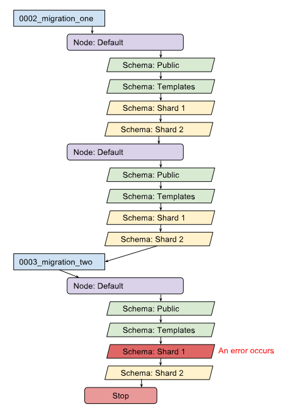

==========
Migrations
==========

Since we work with multiple nodes and multiple schemas, performing migrations is more involved.

* Mirrored models are always migrated to the public schema of each node.
* Sharded models are migrated to each (non-public) schema of all nodes.
* Default models (those who are neither Mirrored nor Sharded) only end up on the public schema of the default node.

Determining where models go is done by the DynamicDbRouter on basis of the decorators set on the model definitions.

This library overrides the ``migrate`` management command with one that executes the migration on each shard of each
node, so running ``migrate`` as usual just works. It is the only migration command; there is nothing else to call.

Making migrations
-----------------
Creating migrations is done as usual. Since it is executed for each shard on each node, you do not have to use
``use_shard`` in data migrations.

Data migrations
~~~~~~~~~~~~~~~
A ``RunPython`` operation is run once for every schema. For every schema, ``migrate`` renders the historical models it
passes as the ``apps`` argument. This is Django-native behavior and completely safe, but can be slow on a larger
schema count. Particularly in tests, this can cause a lot of overhead which is unnecessary since each schema can be
expected to start at the same state. Set ``QUILT_DB['SHARED_TEST_MIGRATION_STATES']`` to ``True`` to make building a new
test database faster: this will make ``migrate`` render the historical models once per migration and hand the public
and template schemas the same model classes.

With that setting on, a data migration must not keep state on those classes or on their managers. Keep what it needs
for a schema in local variables of its function instead:

.. code-block:: python

   def set_default_type(apps, schema_editor):
       Cake = apps.get_model('example', 'Cake')
       CakeType = apps.get_model('example', 'CakeType')

       # Wrong: the next schema would find this schema's CakeType here, and write its id into its own rows.
       # Cake._default_type = CakeType.objects.get(name='plain')

       # Right: look it up again for every schema.
       default_type = CakeType.objects.get(name='plain')
       Cake.objects.filter(type=None).update(type=default_type)

There is a limited safety check in the command to make sure you don't unwittingly cause errors due to such code. If a
data migration adds, removes or replaces an attribute of a historical model class (or of one of its managers), the
change will be undone and the migration will fail for that schema with a ``HistoricalModelsChanged`` error naming the
attribute. This is an indication that you should leave the setting off.

.. warning::

   While the check is intended to catch obvious errors, it cannot guarantee an exhaustive safety audit. The check only
   compares the attributes of the historical model classes and of their managers. State that a data migration keeps
   elsewhere about those classes carries over to the next schema without failing it, such as:

   * a change made inside an attribute that was already there, such as an item added to a dictionary on the class;
   * anything kept on a model's ``_meta``;
   * a cache keyed by the class, such as a function decorated with ``functools.lru_cache`` that is passed the model,
     or a module-level dictionary;
   * a signal receiver connected with a historical model as its ``sender``;
   * an attribute set on the ``apps`` registry the data migration is handed.

   Only turn the setting on when the project's data migrations rely on none of these.

   When in doubt, leave the setting off.

As the speed gains are most useful for local development (with repeated, possibly targeted runs) it is recommended to
disable the setting in CI environments where the relative speed gains are marginal. This also ensures that in case you
do have any code violating the constraints above, it will still be caught somewhere.

Calling migrate
---------------

``migrate`` does two things regarding the way it applies migrations:

Determine migration state
~~~~~~~~~~~~~~~~~~~~~~~~~

Like the original, the command has to determine what the current state of the database is, to draft a list of
migrations to execute: the migration plan.
Since we have multiple shards, it has to check the current state on each of them, in case they are not in sync with
each other.
After it has done this, it looks for the 'least migrated' state: the state with the least migrations performed.
It makes this the start point, and creates a plan from that point to the target state (either the latest or a target
given as argument).

Applying migrations to each shard
~~~~~~~~~~~~~~~~~~~~~~~~~~~~~~~~~
Now we have a migration plan, the command executes this one migration at a time. For each migration it will loop over
all the nodes.
For each node it will execute the given migration to the public and template schema which exist on each node.
After that it will apply the migration to each of the shard schemas found on the node. When done all that, it will
progress to the next node.

If the migration is already performed on a particular schema, it will simply not execute it and move on.

If an error occurs it will try to finish applying the migration on all schemas on the node the error occurred.
After that it will stop the whole process.
It does this so a node will be in a single state as much as possible. But when an error occurred, it won't try any
other nodes. Instead it will prompt the error.
You can try to roll back the failed migration on the damaged node if you want, or alter the migration and try again.

The error handling is the main reason the ``migrate`` command goes migration by migration. And not run all the
migrations on a node before moving on to the next node. We want to keep the nodes similar as much as possible.

Options
-------
The sharded ``migrate`` command extends Django's normal ``migrate`` command. Thus it knows the same arguments.

``--database``
~~~~~~~~~~~~~~
The ``--database`` argument defaults to `all`. But you can provide a name (as listed in the database connections in
settings) if you want to migrate a single node.
Example: ``migrate --database hoth``

``--shard``
~~~~~~~~~~~
``--shard`` (or ``-s``) is a new argument. This allows you to specify a single shard by using the name of the node
and the shard alias known to the Shard table (or ``public`` if you want to target that).
For example: ``migrate -s default|public`` or ``migrate -s hoth|rebellious_shard``
Note the ``|`` (pipe) between the node name and the schema name.

Router considerations
---------------------

The DynamicDbRouter will ensure the tables will only be created on the schemas they should be created on.
To do that, it looks at the sharding mode of models during ``allow_migrate``.

This can be a problem if the migration to be extecuted no longer has a model known to Django; most likely because
you removed it and the migration is to remove the table as well.
Any migration operation related to a model of which we cannot confirm the sharding mode is NOT executed on the database.
This is no problem for models that have been migrated in the past, or when a model is only created and removed in old
migrations and you perform them from scratch.

If you want to remove a model, use ``migrations.SeparateDatabaseAndState`` to remove it from the state and use runSQL
with a hint to remove the tables from the database.

.. code-block:: python

   from django.db import migrations

   from djanquiltdb import ShardingMode

   class Migration(migrations.Migration):

       dependencies = [
           ('example', '0001_initial'),
       ]

       operations = [
           migrations.SeparateDatabaseAndState(
               state_operations=[
                   migrations.DeleteModel('Knights'),
               ],
               database_operations=[
                   migrations.RunSQL('DROP TABLE example_knights CASCADE;',
                   hints={'sharding_mode': ShardingMode.SHARDED})
               ]
           )
       ]

Note that the sharding mode goes in the ``hints`` dictionary. ``RunSQL`` and ``RunPython`` pass it straight to the
router's ``allow_migrate``, and without it the router cannot tell where the operation belongs and raises a
``ProgrammingError``.
