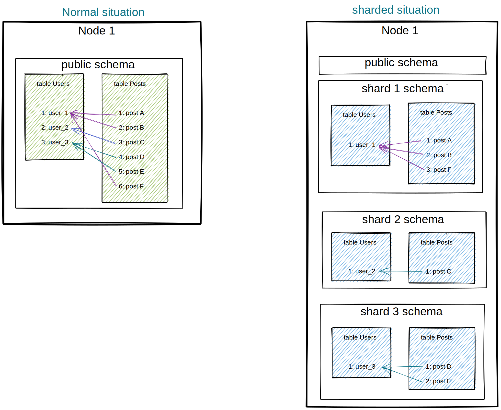
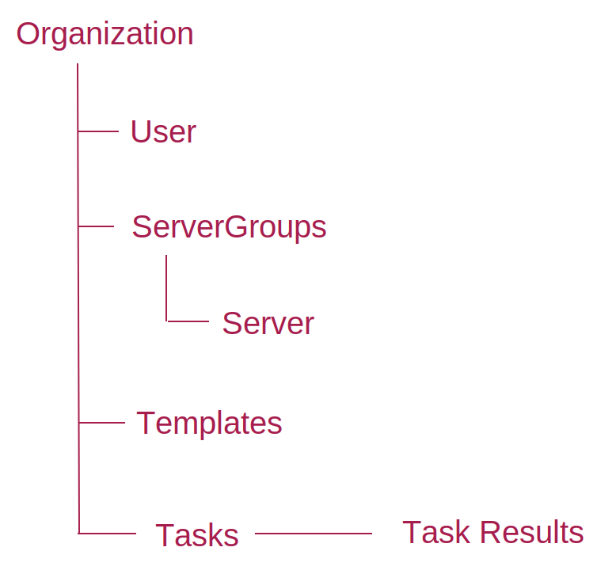
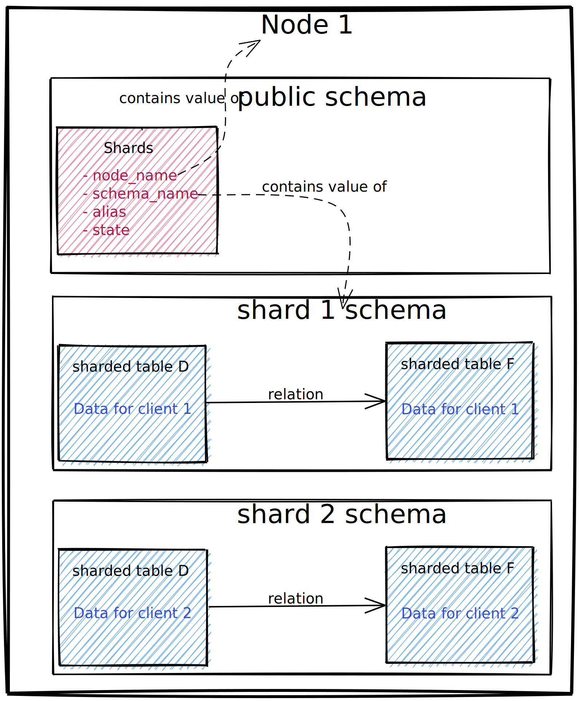
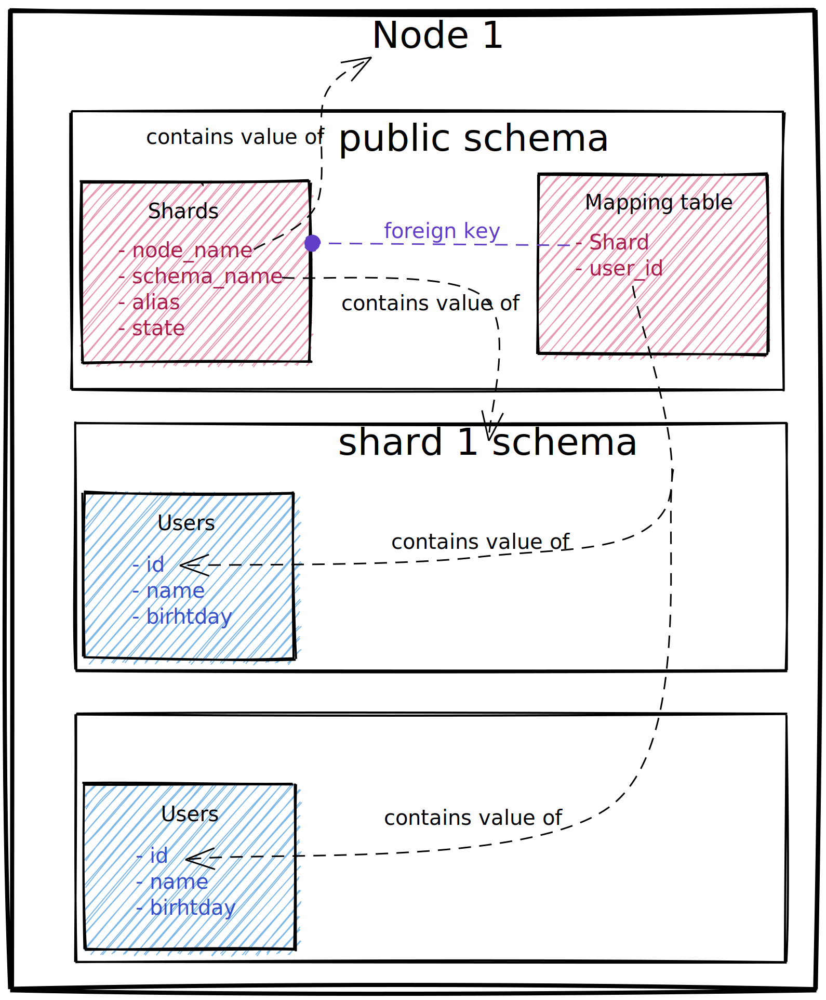
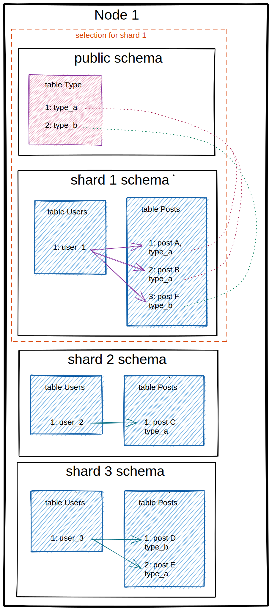
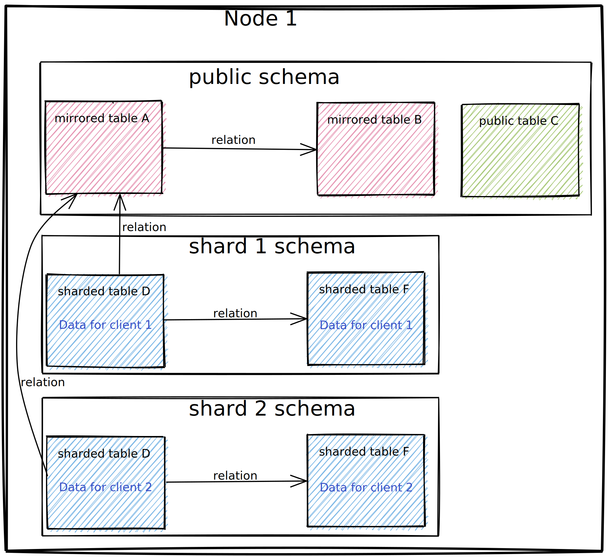
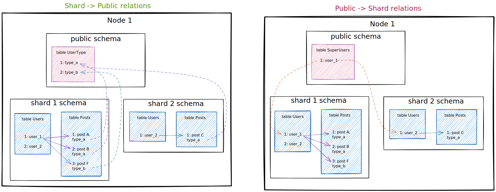
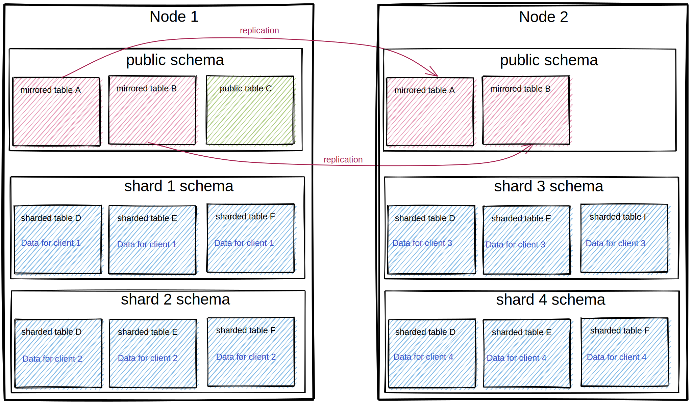

========
Overview
========

DjangoSharding is a library meant for Django projects that use PostgreSQL as database. It aims to separate data per
user, groups of users or tenants. And thus keep the size of the tables small in order to make querying them efficient.
In addition, data between users cannot contaminate or influence each other.
To do is, it creates a postgres schema per tenant, which we call a shard. All data belonging to that tenant will be
stored in that shard. There can be many shards in a database, but can also be spread across multiple databases if
desired. Since the user data is contained, users on database A do not have to notice database B is down.
This library provides tools to easily create shards, select a shard to query, migrate all shards, and move data from
one shard to another.

Hierarchy
~~~~~~~~~
This Library assumes the client data is structured in such a way all data can be traced (bia relations) back to a
single datapoint. It does not matter what data point that is. Usually it's a User, Organization, Client-like object.

Example data structure with 'organization' as top-level object.

The documentation will refer to this root datapoint as top-level object. This is especially important when
relating to the management commands to move data around from shard to shard.
We'll call it 'client' for now.

The Problem
~~~~~~~~~~~

Normally, one keeps all the data from all the clients in one set of table. By default, that is on the 'public' schema in
postgres. This is great, since it's easy to access any data. The more popular your product becomes, the bigger the
tables get, and gradually the performance of your product suffers. Since big tables are slow to filter through. And
you continually have to do that, since most of the time you want all data points belonging to a particular client.

The solution
~~~~~~~~~~~~
In the situation where you want to select data points for one client often, and data points for multiple clients rarely:
separating client data becomes a very obvious solution. This sharding library does just that. Each client gets their own
shard. On that shard is all their data, and only one shard is needed to get all their data.

Shards
~~~~~~
What we call a shard is both the concept of "a container where client data is stored", and the implementation of this:
a location of a postgres schema with the client data in it.

This library introduces a table for shards: `django_sharding.models.Shard`.
These sharding objects have four attributes: `id, name, node_name, schema_name`. The `id` and `name` are simply for
convenience. the meat is the combination of `node_name` and `schema_name`. Together they are unique. And you can easily
see how these two are used to tell the database where we want to find our data.
When creating a shard object
(`Shard.objects.create(name='my shard', node_name='default', schema_name='my_first_schema')`) it will create the
Postgres schema for you with the given name, on the given database connection.

.. note:: Shard per client?

It's entirely possible to put multiple client's data on one shard. That is effectively how it is without this library.
Splitting your data up into several shards, with multiple clients on each; or giving each client their own shard;
are both supported use cases.
In practice, we use it in the latter scenario. Each of our clients have their own shard, with the exception of an
'archive' shard, where a bunch of stale clients data end up moved to.

Mapping table
~~~~~~~~~~~~~
The Shard model keeps a list of all the shards we have created, but not what's in them. That job belongs to the
mapping table.

This table is essentially a lookup table to know which tenant lives on which shard. This table is created by the
library user, but has certain formatting rules. It must have a relation to the Shard model, and a field on which we
map our top-level object. `user_id` is an example. With this model we can ask for our shard for user '1', etc.
A detail here, this mapping field is not a relation/foreign-key. Just an integer field containing unique values.

Shared data and schema selection
~~~~~~~~~~~~~~~~~~~~~~~~~~~~~~~~
Not all data in your database are bound to clients. There are tables containing 'general' data as well. These remain on
the public schema, like before.

Here come the trick. When we instruct the library to 'select a shard' it will set the Postgres search_path to both the
corresponding schema and the public schema. So the set of tables is always complete and what you expect.

The complication: relations and id collision
~~~~~~~~~~~~~~~~~~~~~~~~~~~~~~~~~~~~~~~~~~~~
Every shard has their own complete set of tables. So all those tables will start their id sequences at 1. Meaning the
same table from different shards cannot be taken together, since all their ids will collide. The data within a shard
can have relations to the 'general' table living in the public schema, but not the other way around.

-------------

For a more detailed example:

The `User` table can reference the `Type` table for a row with id '1' no problem. There is only one `Type` table.
If the `Type` table has a reference to a `User` table for a row with id '1', which row would that be? Relations do not
contain a schema selection.

This is why the mapping table does not have relations to the defining objects of the shard.

Another scaling problem?
~~~~~~~~~~~~~~~~~~~~~~~~
So instead of: the data of, let's say, a thousand clients all in the same set of tables, we're going to deal with a
thousand shards, all having their own table set?
Does that not have their own scaling problem? Does Postgres like this?
Mostly: yes, yes, yes and no. Postgres has no problems having thousands of schemas. But in some aspects this does
become a particular scaling problem of it own.
* Migration. Migrations are not so much a problem, as that it simply takes a lot longer. Data migrations do not of
course, the amount of datapoints is the same. But altering table schemas has to be done a lot more, since there are a
lot more tables.
* Postgres info tables. Postgres has several tables in the background that keep track of things. Like table constrains.
These tables get a lot bigger, since there are a lot more table constrains. This is not a problem,
but something to be aware of when consulting these tables.

Multi node, multi shard
~~~~~~~~~~~~~~~~~~~~~~~
Since we are separating data, there is not reason to stop with creating multiple schemas on one database.
We can just as easy spread shards out over multiple databases/nodes.
This is mostly transparent, since we are telling Django on what shard we are working on anyway.

There is only one complication: the public models. Since they probably have to exist on each node. Migrating them to
all nodes is done by this library. Keeping their contents in sync is not. We solve this by Postgres Logical Replication.
But go for whatever replicating solution you like. Just writing the data to all nodes from python can also work.
