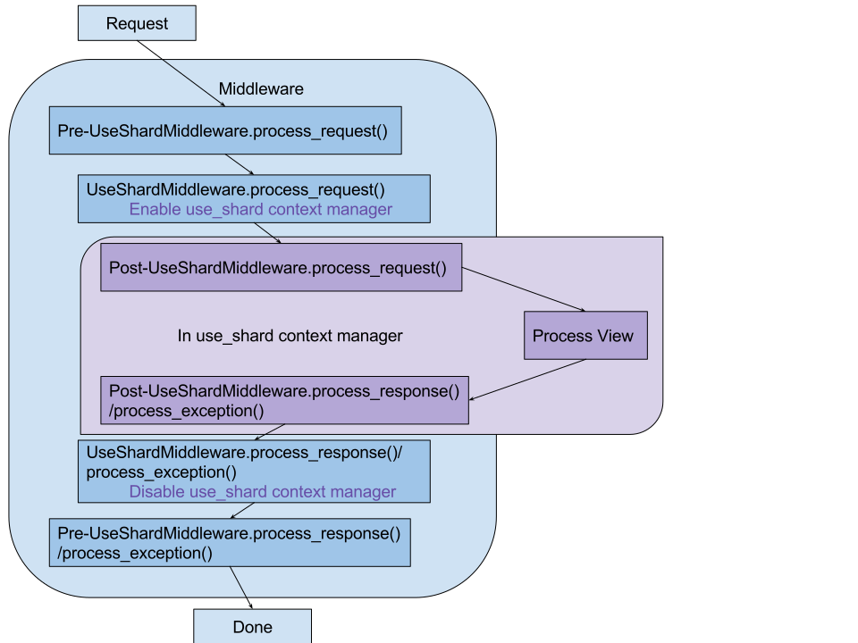

=========
Structure
=========

Structure of Django-sharding
~~~~~~~~~~~~~~~~~~~~~~~~~~~~

Nodes
~~~~~

Nodes are entries in the DATABASES section of the Django settings. The names you give them there are the node names.

.. code-block:: python

    DATABASES = {
        'default': {
            'ENGINE': 'sharding.postgresql_backend',
            'NAME': 'primary_database',
            'USER': 'mydatabaseuser',
            'PASSWORD': 'mypassword',
            'HOST': '127.0.0.1',
            'PORT': '5432'},
        'second': {
            'ENGINE': 'sharding.postgresql_backend',
            'NAME': 'secondary_database',
            'USER': 'mydatabaseuser',
            'PASSWORD': 'mypassword',
            'HOST': '127.0.0.1',
            'PORT': '5433'},  # same server, different pSQL installation
        }
    }

Shards
~~~~~~

A Shard is a combination of a node_name and schema_name. We list all shards in the Shard model.
When an entry is made to the Shard model a schema is made on that Node.

When we 'use' a Shard, we route the queries to the correct Node and set the connection's search path to the Shard's schema_name.

Views
-----

To prevent the need to write ``with use_shard(shard_id):`` in every view your project has, this library provides a middleware to do that for you.

The ``UseShardMiddleware`` will enable a use_shard context manager in ``process_request`` and close it in ``process_response`` or ``process_exception``.

Since it inherits ``StateExceptionMiddleware`` It will raise a 503 error if the shard required is in a non-active state.

See :ref:`use_shard_middleware` for details about using this middleware.